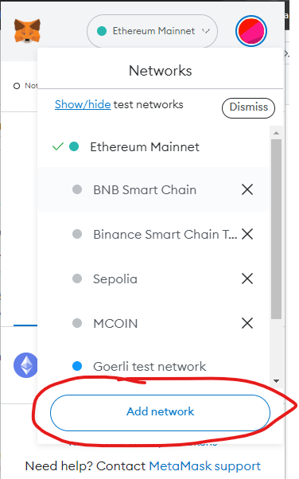
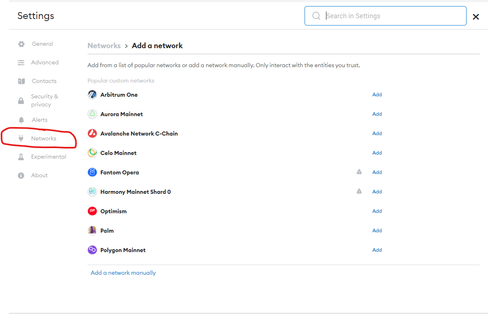
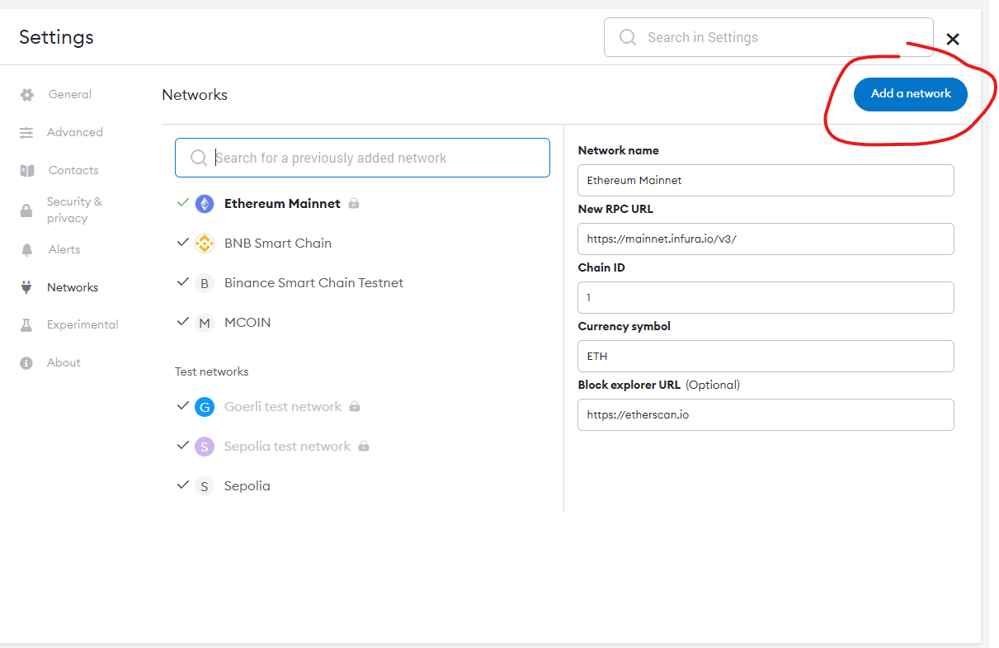
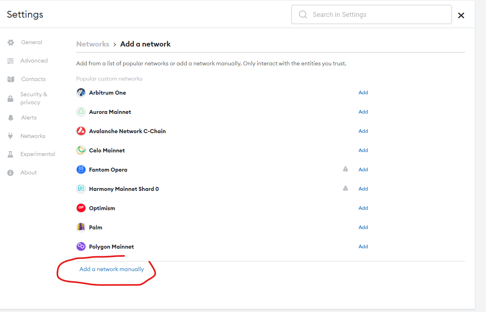
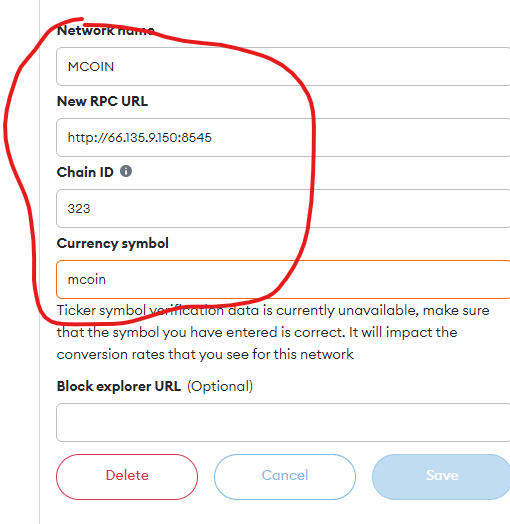

# mcoin-evm Docs


### Ports 

- 8545: chain rpc
- 8546: socket rpc


### Recommended server specs

> 8 core, 16 GB ram, 500GB harddisk

### Chain details

- Network name: Mcoin Network
- chainId: 323
- Symbol: MCOIN
- RPC: rpc1.m20chain.com
- Explorer: explorer.m20chain.com

# Mcoinchain deployment script

```
sudo apt update
sudo apt upgrade -y
sudo apt install build-essential jq -y
```

## Install Golang:

## Install latest go version https://golang.org/doc/install
```
wget -q -O - https://raw.githubusercontent.com/canha/golang-tools-install-script/master/goinstall.sh | bash -s -- --version 1.18
source ~/.profile
```

## to verify that Golang installed
```
go version
```
// Should return go version go1.18 linux/amd64

## Install the executables

```
sudo rm -rf ~/.mcoin
make install

clear

## Running chain
./local.sh

## Create the service file "/etc/systemd/system/mcoind.service" with the following content
```
sudo nano /etc/systemd/system/mcoind.service
```

## paste following content
```
[Unit]
Description=mcoind
Requires=network-online.target
After=network-online.target

[Service]
Restart=on-failure
RestartSec=3
User=root
Group=root
Environment=DAEMON_NAME=mcoind
Environment=DAEMON_HOME=/root/.mcoin
Environment=DAEMON_ALLOW_DOWNLOAD_BINARIES=on
Environment=DAEMON_RESTART_AFTER_UPGRADE=on
PermissionsStartOnly=true
ExecStart=/root/go/bin/mcoin start --pruning="nothing"
ExecReload=/bin/kill -HUP $MAINPID
KillSignal=SIGTERM
LimitNOFILE=4096

[Install]
WantedBy=multi-user.target
## start chain node ##
```
sudo systemctl enable mcoind
sudo systemctl start mcoind
```
## stop chain node ##
```
sudo systemctl stop mcoind
```
# Adding Mcoin chain on Metamask
## on metamask





## Add account
please create an new account on MM or import private key
